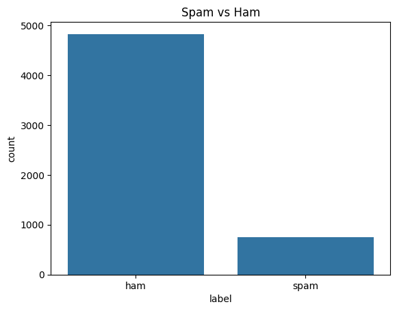
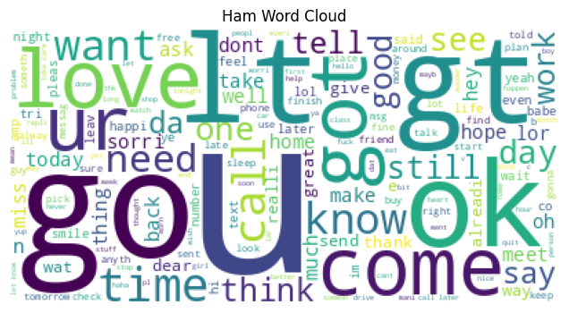
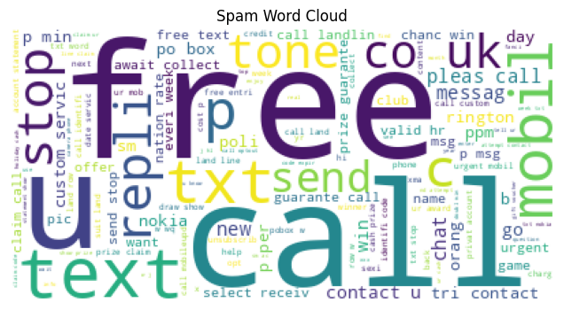
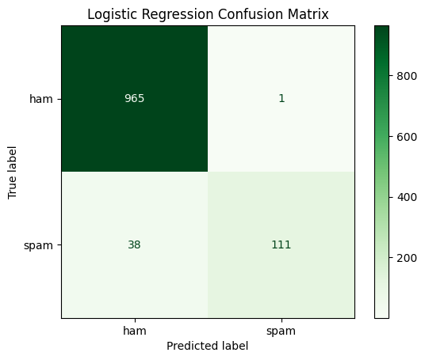
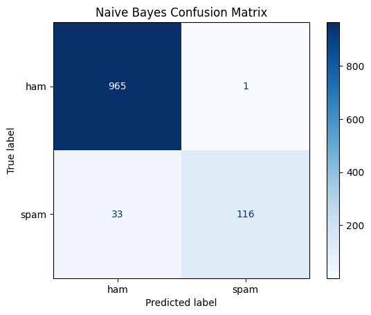

# 📧 Spam Email Detection using Machine Learning

A machine learning project that classifies email/SMS messages as **Spam** or **Ham (Not Spam)** using Natural Language Processing (NLP) and supervised learning algorithms.

## 📌 Project Overview

Spam messages are unwanted messages that may contain advertisements, scams, malicious links, or other unwanted content. This project builds machine learning models to automatically identify whether a given message is spam or legitimate.

The project includes:

- Data loading and exploration
- Data preprocessing
- Text cleaning
- Exploratory Data Analysis (EDA)
- Word frequency analysis
- Text vectorization
- Machine learning model training
- Model evaluation
- Confusion matrix visualization

## 📂 Repository Structure

```text
spam-email-detection/
│
├── Email_Spam_Detection.ipynb
├── spam.csv
├── README.md
│
├── class_distribution.png
├── ham_wordcloud.png
├── spam_wordcloud.png
├── lr_confusion_matrix.png
└── nb_confusion_matrix.png
```

## 🛠️ Technologies Used

- Python
- Pandas
- NumPy
- Matplotlib
- Seaborn
- Scikit-learn
- Natural Language Processing (NLP)
- Jupyter Notebook

## 🔄 Machine Learning Workflow

```text
Dataset
   ↓
Data Cleaning
   ↓
Exploratory Data Analysis
   ↓
Text Preprocessing
   ↓
Feature Extraction / Vectorization
   ↓
Train-Test Split
   ↓
Model Training
   ↓
Model Evaluation
   ↓
Spam / Ham Prediction
```

## 🤖 Machine Learning Models

### 1. Logistic Regression

Logistic Regression is used as a classification algorithm to distinguish between spam and legitimate messages.

### 2. Naive Bayes

Naive Bayes is well suited for text classification because it performs effectively with high-dimensional text features.

The models are evaluated using classification metrics and confusion matrices.

## 📊 Exploratory Data Analysis

### Class Distribution



### Ham Word Cloud



### Spam Word Cloud



## 📈 Model Evaluation

The models are evaluated using:

- Accuracy
- Precision
- Recall
- F1-Score
- Confusion Matrix

### Logistic Regression



### Naive Bayes



## 🚀 How to Run the Project

### 1. Clone the repository

```bash
git clone https://github.com/srikar6259/spam-email-detection.git
```

### 2. Navigate to the project directory

```bash
cd spam-email-detection
```

### 3. Install the required libraries

```bash
pip install pandas numpy matplotlib seaborn scikit-learn jupyter
```

### 4. Start Jupyter Notebook

```bash
jupyter notebook
```

### 5. Open the notebook

```text
Email_Spam_Detection.ipynb
```

Run the notebook cells sequentially to reproduce the analysis and model results.

## 📁 Dataset

The project uses the `spam.csv` dataset containing messages labeled as:

- **ham** – legitimate/non-spam message
- **spam** – unwanted/spam message

## 🎯 Objective

The main objective of this project is to demonstrate how Natural Language Processing and machine learning can be used to automatically classify messages and detect spam.

## 🔮 Future Improvements

- Test additional machine learning algorithms
- Perform hyperparameter tuning
- Use TF-IDF and n-gram features
- Experiment with deep learning models
- Build a web application for real-time spam detection
- Deploy the trained model as an API
- Add real-time email classification

